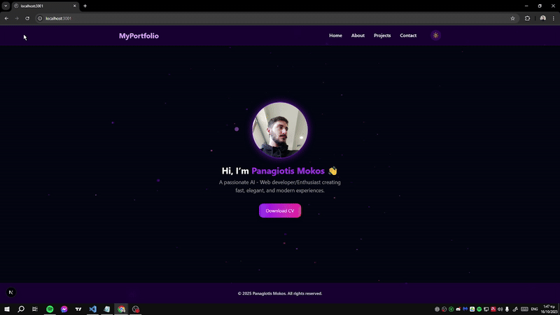

# 🌐 My Developer Portfolio

A sleek, animated personal portfolio built with **Next.js 14**, **Tailwind CSS**, and **Framer Motion** — featuring smooth transitions, a dynamic dark/light theme, and a responsive design that looks great on any device.

---

## ✨ Features

- ⚡ **Next.js 14 (App Router)** — fast, modern React architecture  
- 🎨 **Tailwind CSS** — rapid styling with utility classes  
- 🎞️ **Framer Motion** — smooth, cinematic animations  
- 🌙 **Dark/Light Theme Toggle** — remembers your preference via localStorage  
- 🌌 **Particle Background** — animated ambient background using WebGL (OGL)  
- 📱 **Fully Responsive** — works beautifully across desktop, tablet, and mobile  
- 🧭 **Multi-page Layout** — Home, About, Projects, and Contact  
- 🧠 **Reusable Theme Context** — provides consistent theming across pages  

---

## 🚀 Live Demo
🎥 **Video Preview:**  


 Link: [**View Portfolio**](https://your-portfolio-link.vercel.app)  


---

## 🧩 Tech Stack

| Technology | Purpose |
|-------------|----------|
| **Next.js** | Framework for React (App Router) |
| **Tailwind CSS** | Styling system |
| **Framer Motion** | Animation library |
| **OGL** | WebGL particles background |
| **Lucide React** | Icon set |
| **TypeScript** | Static typing (optional) |

---

## 🛠️ Installation

Clone the repository and install dependencies:

```bash
git clone https://github.com/yourusername/my-portfolio.git
cd my-portfolio
npm install
